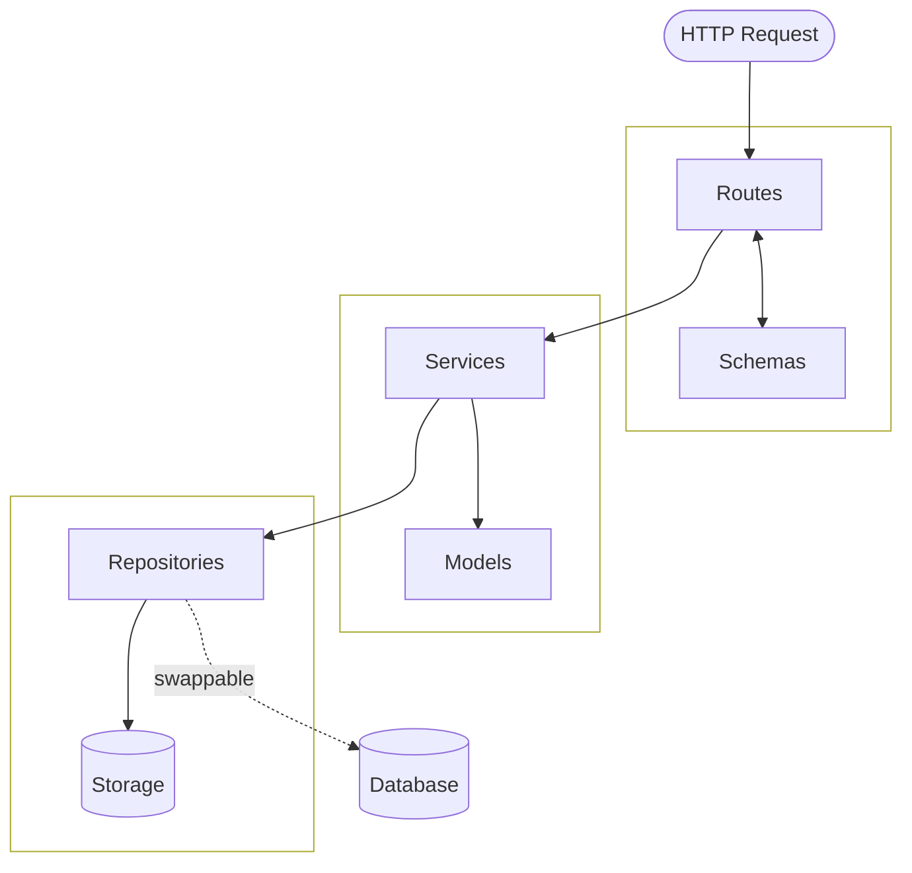
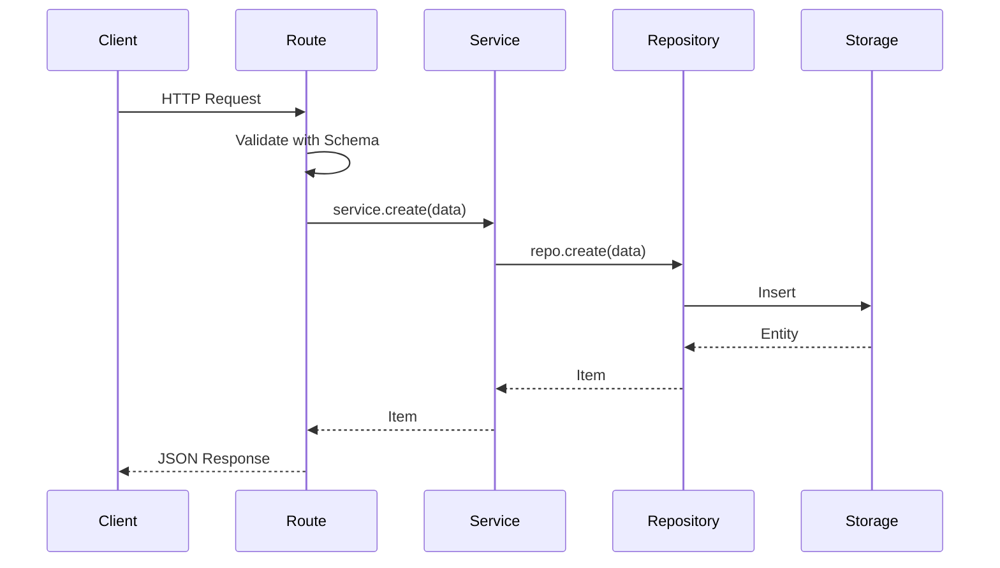
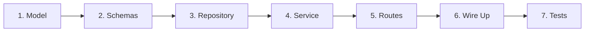

<a id="top"></a>
<div align="center">

# 🐍 Python Template

### Production-ready Python project template with layered architecture and modern tooling
Clone → Configure → Build

[Quick Start](#quick-start) • [Architecture](#architecture) • [Configuration](#configuration) • [Docker](#docker) • [API Reference](#api-reference)

[](https://python.org)
[](https://fastapi.tiangolo.com)
[](https://docs.astral.sh/uv/)
[](https://docs.astral.sh/ruff/)
[](https://docker.com)
[](LICENSE)

</div>

---

## Overview

This template provides a solid foundation for building Python web services. It includes:

- **Layered architecture** — Routes, services, repositories with clear separation of concerns
- **Type safety** — Strict mypy configuration with Pydantic validation throughout
- **Fast tooling** — uv for dependency management, Ruff for linting/formatting
- **Docker-ready** — Multi-stage builds with development and production targets
- **Testing** — pytest with async support and coverage reporting
- **Debugging** — VS Code + debugpy integration for local and containerized development

The example Item API demonstrates the patterns. Delete it and add your own domain logic.

---

## Quick Start

**Prerequisites:** Python 3.12+, [uv](https://docs.astral.sh/uv/getting-started/installation/), Docker (optional)

```bash
# Clone and enter the project
git clone https://github.com/your-username/your-project.git
cd your-project

# Copy configuration files
cp env.example .env
cp -r .vscode.example .vscode

# Install dependencies and start the server
make install-dev
make dev
```

Open http://127.0.0.1:8000/docs to see the interactive API documentation.

**Other useful commands:**

```bash
make test        # Run tests with coverage
make check       # Run lint, typecheck, and tests
make docker-dev  # Run in Docker with hot reload + debugpy
```

Run `make help` to see all available commands.

---

## Project Structure

```
your-project/
├── src/your_package/
│   ├── config.py              # Environment configuration (pydantic-settings)
│   ├── logging.py             # Structured logging (JSON/pretty)
│   ├── debug.py               # Debugpy integration
│   │
│   ├── models/                # Domain entities
│   │   └── items.py
│   │
│   ├── repositories/          # Data access layer
│   │   ├── base.py            # BaseRepository interface
│   │   ├── memory.py          # InMemoryRepository (dict-based)
│   │   └── items.py           # ItemRepository
│   │
│   ├── services/              # Business logic layer
│   │   ├── base.py            # BaseService[T, CreateT, UpdateT]
│   │   └── items.py           # ItemService
│   │
│   └── api/                   # HTTP layer
│       ├── app.py             # FastAPI application factory
│       ├── asgi.py            # ASGI entrypoint
│       ├── lifespan.py        # Startup/shutdown lifecycle
│       ├── dependencies.py    # Typed dependency injection
│       ├── exceptions.py      # Error handlers
│       ├── schemas/           # Request/response DTOs
│       └── routes/            # Endpoint definitions
│
├── tests/                     # Test suite
├── pyproject.toml             # Dependencies and tool configuration
├── Makefile                   # Development commands
├── Dockerfile                 # Multi-stage container build
├── docker-compose.yml         # Container orchestration
└── .pre-commit-config.yaml    # Pre-commit hooks
```

---

## Architecture

The template follows a layered architecture that keeps concerns separated:



**Layer responsibilities:**

| Layer | Purpose | Example |
|-------|---------|---------|
| **Routes** | HTTP handlers, request/response | `GET /v1/items/{id}` |
| **Schemas** | Request/response validation | `ItemCreate`, `ItemUpdate` |
| **Services** | Business logic, orchestration | `ItemService.get_or_raise()` |
| **Repositories** | Data access abstraction | `ItemRepository.create()` |
| **Models** | Domain entities | `Item` |

**Request flow:**



**Why this pattern?**

- Routes stay thin — easy to test, easy to read
- Services are testable — mock the repository, test business logic in isolation
- Repositories are swappable — change storage without touching services or routes

---

## Configuration

Environment variables are managed with [pydantic-settings](https://docs.pydantic.dev/latest/concepts/pydantic_settings/). Copy `env.example` to `.env` and customize:

| Variable | Default | Description |
|----------|---------|-------------|
| `PYTHON_TEMPLATE_HOST` | `127.0.0.1` | Server bind address |
| `PYTHON_TEMPLATE_PORT` | `8000` | Server port |
| `PYTHON_TEMPLATE_LOG_LEVEL` | `info` | `debug`, `info`, `warning`, `error`, `critical` |
| `PYTHON_TEMPLATE_LOG_FORMAT` | `json` | `json` (production) or `pretty` (development) |
| `PYTHON_TEMPLATE_DEBUGPY` | `0` | Enable debugpy (`0` or `1`) |

**Adding new settings:**

```python
# src/your_package/config.py
class Settings(BaseSettings):
    database_url: str = Field(default="sqlite:///./app.db")
```

```python
# Usage
from your_package.config import settings
db = create_engine(settings.database_url)
```

---

## Development Workflow

### Adding a New Domain Entity

Follow this pattern to add new features (example: `users`):



**1. Model** — Define the domain entity

```python
# src/your_package/models/users.py
class User(BaseModel):
    id: str
    email: str
    name: str
    created_at: datetime
```

**2. Schemas** — Define request/response shapes

```python
# src/your_package/api/schemas/users.py
class UserCreate(BaseModel):
    email: EmailStr
    name: str = Field(min_length=1, max_length=100)

class UserUpdate(BaseModel):
    name: str | None = Field(default=None, min_length=1, max_length=100)
```

**3. Repository** — Data access

```python
# src/your_package/repositories/users.py
class UserRepository(InMemoryRepository[User, UserCreate, UserUpdate]):
    async def find_by_email(self, email: str) -> User | None:
        for item in self._data.values():
            if item.get("email") == email:
                return self._dict_to_model(item)
        return None
```

**4. Service** — Business logic

```python
# src/your_package/services/users.py
class UserService(BaseService[User, UserCreate, UserUpdate]):
    def __init__(self, repository: UserRepository) -> None:
        super().__init__(repository)
        self._user_repo = repository

    async def get_by_email(self, email: str) -> User | None:
        return await self._user_repo.find_by_email(email)
```

**5. Routes** — HTTP endpoints

```python
# src/your_package/api/routes/users.py
router = APIRouter(prefix="/users", tags=["users"])

@router.post("", response_model=User, status_code=201)
async def create_user(data: UserCreate, service: UserServiceDep) -> User:
    return await service.create(data)
```

**6. Wire it up** — Add to dependencies and lifespan

```python
# src/your_package/api/dependencies.py
@dataclass
class AppState:
    item_repository: ItemRepository
    item_service: ItemService
    user_repository: UserRepository  # Add new
    user_service: UserService        # Add new
```

**7. Write tests** — Repository, service, and endpoint tests

```python
# tests/test_users.py
def test_create_user(client: TestClient) -> None:
    response = client.post("/v1/users", json={"email": "test@example.com", "name": "Test"})
    assert response.status_code == 201
```

---

## Swapping to a Database

The repository pattern makes database integration straightforward. The services and routes don't change.

**MongoDB example:**

```python
class MongoRepository[T, CreateT, UpdateT](BaseRepository[T, CreateT, UpdateT]):
    def __init__(self, collection: AsyncIOMotorCollection) -> None:
        self._collection = collection

    async def get(self, id: str) -> T | None:
        doc = await self._collection.find_one({"_id": id})
        return self._model_type.model_validate(doc) if doc else None

    # ... implement other methods
```

**Migration steps:**

1. Install database driver (`motor`, `asyncpg`, `sqlalchemy`, etc.)
2. Create database-specific repository implementing `BaseRepository`
3. Update `lifespan.py` to initialize database connection
4. Swap repository in `AppState`
5. Services and routes remain unchanged

---

## Docker

The Dockerfile provides two targets:

| Target | Command | Features |
|--------|---------|----------|
| `runtime` | `make docker-run` | Production build, no dev tools |
| `runtime-dev` | `make docker-dev` | Hot reload, debugpy on port 5678, source mounted |

```bash
make docker-build  # Build production image
make docker-run    # Run production container
make docker-dev    # Run development container
make docker-down   # Stop containers
```

---

## Debugging

### Local (VS Code)

1. Copy `.vscode.example` to `.vscode`
2. Set breakpoints
3. Press `F5` → Select **"Python: FastAPI"**

### Docker (Remote)

1. Start dev container: `make docker-dev`
2. Press `F5` → Select **"Attach (Docker dev)"**
3. Breakpoints work inside the container

---

## API Reference

### Health Check

```
GET /healthz
```

```json
{"status": "ok", "version": "0.1.0"}
```

### Items API

| Method | Endpoint | Description |
|--------|----------|-------------|
| `GET` | `/v1/items` | List items (paginated) |
| `GET` | `/v1/items/{id}` | Get item by ID |
| `POST` | `/v1/items` | Create item |
| `PUT` | `/v1/items/{id}` | Update item |
| `DELETE` | `/v1/items/{id}` | Delete item |

**Interactive docs:** http://127.0.0.1:8000/docs

---

## Using This Template

### Setup Script

Run the interactive setup script to configure your project:

```bash
git clone https://github.com/your-username/python-template.git my-project
cd my-project
python3 setup.py
```

The script will prompt you for:

| Prompt | Description |
|--------|-------------|
| **Project name** | Lowercase with underscores (e.g., `inventory_service`) |
| **Description** | Short project description |
| **Author** | Name and email (e.g., `Jane Doe <jane@example.com>`) |
| **Project type** | `service` or `library` |

**Project types:**

| Type | Description |
|------|-------------|
| `service` | Full FastAPI web service with Docker, API layer, and all dependencies |
| `library` | Pip-installable package — removes API, Docker, and server dependencies |

**What the script does:**

- Renames `src/python_template/` to `src/your_project/`
- Updates all imports and references across the codebase
- Copies `env.example` → `.env` and `.vscode.example/` → `.vscode/`
- Updates `pyproject.toml` with your project metadata
- Generates a fresh README
- Self-destructs after completion

**To revert and try again:**

```bash
git checkout . && git clean -fd
```

This restores all files to their original state so you can re-run the setup.

---

## License

MIT License — see [LICENSE](LICENSE) for details.

---

<div align="center">

Made with :heart: for the Python community

[Back to top](#top)

</div>
