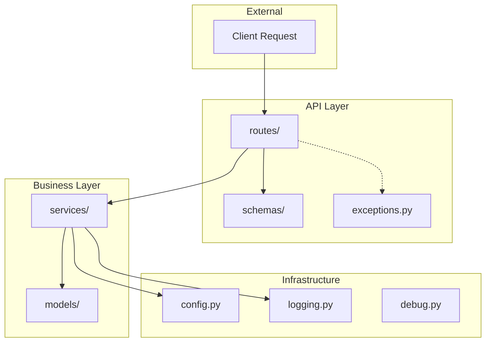
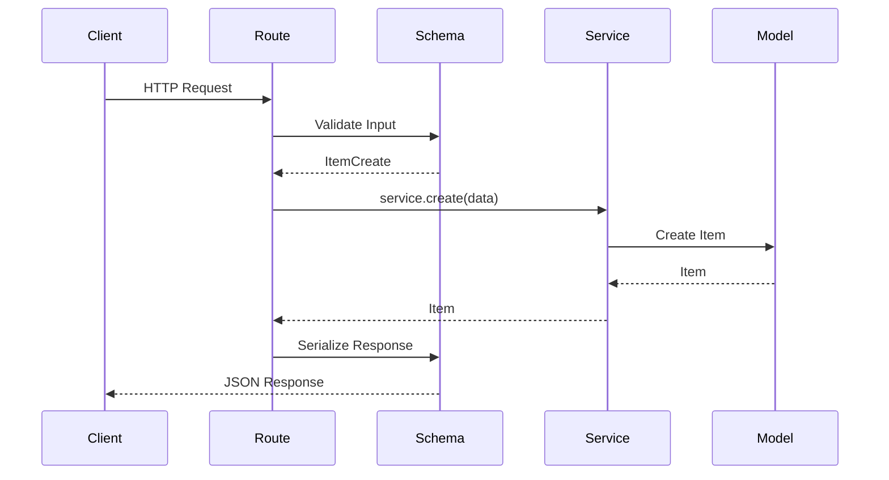
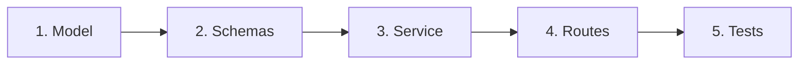
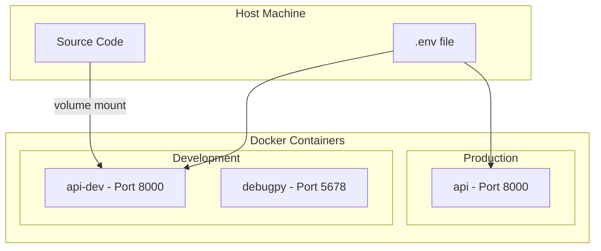

<div align="center">

# 🐍 Python Template

**A production-ready Python project template with FastAPI, Pydantic, uv, and Docker**

[](https://python.org)
[](https://fastapi.tiangolo.com)
[](https://docs.pydantic.dev)
[](https://docs.astral.sh/uv/)
[](https://docs.astral.sh/ruff/)
[](https://docker.com)
[](LICENSE)

*Stop setting up projects from scratch. Start building.*

[Quick Start](#-quick-start) •
[Documentation](#-project-structure) •
[Commands](#-makefile-commands) •
[Docker](#-docker) •
[Use as Template](#-using-as-a-template)

</div>

---

## ✨ Features

| Feature | Description |
|---------|-------------|
| 🏗️ **Modern Python** | Python 3.12+ with full type hints and `src/` layout |
| ⚡ **FastAPI** | Async API with automatic OpenAPI docs |
| 📦 **Pydantic** | Data validation, settings, and serialization |
| 🚀 **uv** | Blazing fast dependency management |
| 🐳 **Docker** | Multi-stage builds with official uv image |
| 🧪 **Testing** | pytest with async support and coverage |
| 🎨 **Code Quality** | Ruff for linting and formatting |
| 🔧 **Makefile** | One-command setup and development |
| 🐛 **Debugging** | VS Code + debugpy integration |
| 📝 **Structured Logging** | JSON (production) or pretty (development) |

---

## 📑 Table of Contents

- [Quick Start](#-quick-start)
- [Architecture](#-architecture)
- [Project Structure](#-project-structure)
- [Makefile Commands](#-makefile-commands)
- [Configuration](#-configuration)
- [Development Workflow](#-development-workflow)
- [Docker](#-docker)
- [Debugging](#-debugging)
- [API Reference](#-api-reference)
- [Using as a Template](#-using-as-a-template)
- [Tech Stack](#-tech-stack)
- [License](#-license)

---

## 🚀 Quick Start

### Prerequisites

- **Python 3.12+** — [Download](https://python.org/downloads/)
- **uv** — [Install](https://docs.astral.sh/uv/getting-started/installation/)
- **Docker** (optional) — [Install](https://docs.docker.com/get-docker/)

### Step-by-Step Setup

```bash
# 1️⃣ Clone the repository
git clone https://github.com/ikaric/python-template.git
cd python-template

# 2️⃣ Copy configuration files
cp env.example .env
cp -r .vscode.example .vscode

# 3️⃣ Install dependencies
make install-dev

# 4️⃣ Start the development server
make dev

# 5️⃣ Run tests (in another terminal)
make test
```

### Verify It's Working

Once running, open your browser:

| URL | Description |
|-----|-------------|
| http://127.0.0.1:8000/healthz | Health check endpoint |
| http://127.0.0.1:8000/docs | Swagger UI (interactive API docs) |
| http://127.0.0.1:8000/redoc | ReDoc (alternative API docs) |

---

## 🏛️ Architecture

This template follows a **layered architecture** pattern that separates concerns and makes the codebase easy to navigate and extend.

### Layer Diagram



### Request Flow



### Layer Responsibilities

| Layer | Purpose | Example |
|-------|---------|---------|
| **routes/** | HTTP handlers, request/response | `GET /v1/items/{id}` |
| **schemas/** | Request/response validation | `ItemCreate`, `ItemUpdate` |
| **services/** | Business logic | `ItemService.create()` |
| **models/** | Domain entities | `Item` |
| **exceptions.py** | Error handling | `NotFoundError` |
| **config.py** | Environment settings | `Settings.log_level` |

---

## 📁 Project Structure

```
python-template/
├── src/
│   └── python_template/
│       ├── __init__.py           # Package version
│       ├── py.typed              # PEP 561 marker (type hints)
│       ├── config.py             # ⚙️  Environment configuration
│       ├── logging.py            # 📝 Structured logging
│       ├── debug.py              # 🐛 Debugpy integration
│       │
│       ├── models/               # 📦 Domain entities
│       │   ├── __init__.py
│       │   └── items.py          #    Item model
│       │
│       ├── services/             # 💼 Business logic
│       │   ├── __init__.py
│       │   ├── base.py           #    BaseService[T, CreateT, UpdateT]
│       │   └── items.py          #    ItemService implementation
│       │
│       └── api/                  # 🌐 HTTP layer
│           ├── __init__.py
│           ├── app.py            #    FastAPI factory
│           ├── asgi.py           #    ASGI entrypoint
│           ├── lifespan.py       #    Startup/shutdown
│           ├── exceptions.py     #    Error handlers
│           │
│           ├── schemas/          # 📋 Request/response DTOs
│           │   ├── __init__.py
│           │   ├── common.py     #    ErrorResponse, HealthResponse
│           │   └── items.py      #    ItemCreate, ItemUpdate
│           │
│           └── routes/           # 🛣️  Endpoints
│               ├── __init__.py
│               ├── health.py     #    /healthz
│               └── items.py      #    /v1/items/*
│
├── tests/                        # 🧪 Test suite
│   ├── __init__.py
│   ├── conftest.py              #    Pytest fixtures
│   ├── test_health.py
│   └── test_items.py
│
├── .vscode.example/              # 💻 VS Code configuration (copy to .vscode/)
│   ├── settings.json
│   ├── launch.json
│   └── extensions.json
│
├── pyproject.toml               # 📦 Project metadata & dependencies
├── Makefile                     # 🔧 Development commands
├── Dockerfile                   # 🐳 Container build
├── docker-compose.yml           # 🐳 Container orchestration
├── env.example                  # ⚙️  Environment template
├── .gitignore
├── .dockerignore
├── .editorconfig
└── README.md                    # 📖 You are here!
```

---

## 🔧 Makefile Commands

All common tasks are available through `make`. Run `make help` for the full list.

### Setup Commands

| Command | Description |
|---------|-------------|
| `make venv` | Create virtual environment with uv |
| `make install` | Install production dependencies |
| `make install-dev` | Install all dependencies (including dev tools) |

### Development Commands

| Command | Description |
|---------|-------------|
| `make dev` | Start server with hot reload |
| `make prod` | Start server without reload |
| `make test` | Run tests with coverage report |
| `make lint` | Check code with Ruff |
| `make format` | Format code with Ruff |

### Docker Commands

| Command | Description |
|---------|-------------|
| `make docker-build` | Build Docker image |
| `make docker-run` | Run production container |
| `make docker-dev` | Run development container (with debugpy) |
| `make docker-down` | Stop and remove containers |

### Maintenance Commands

| Command | Description |
|---------|-------------|
| `make clean` | Remove build artifacts, venv, caches |

---

## ⚙️ Configuration

Configuration is managed through **environment variables** using [pydantic-settings](https://docs.pydantic.dev/latest/concepts/pydantic_settings/).

### Environment Variables

Copy `env.example` to `.env` and customize:

```bash
cp env.example .env
```

| Variable | Default | Description |
|----------|---------|-------------|
| `PYTHON_TEMPLATE_HOST` | `127.0.0.1` | Server bind address |
| `PYTHON_TEMPLATE_PORT` | `8000` | Server port |
| `PYTHON_TEMPLATE_LOG_LEVEL` | `info` | Logging level (`debug`, `info`, `warning`, `error`, `critical`) |
| `PYTHON_TEMPLATE_LOG_FORMAT` | `json` | Log format (`json` for production, `pretty` for development) |
| `PYTHON_TEMPLATE_DEBUGPY` | `0` | Enable remote debugging (`0` or `1`) |
| `PYTHON_TEMPLATE_DEBUGPY_HOST` | `0.0.0.0` | Debugpy listen address |
| `PYTHON_TEMPLATE_DEBUGPY_PORT` | `5678` | Debugpy listen port |
| `PYTHON_TEMPLATE_DEBUGPY_WAIT` | `0` | Wait for debugger before starting |

### Adding New Settings

1. Add the variable to `env.example`:
```bash
PYTHON_TEMPLATE_DATABASE_URL=postgresql://localhost/mydb
```

2. Add the field to `src/python_template/config.py`:
```python
class Settings(BaseSettings):
    # ... existing fields ...
    database_url: str = Field(default="sqlite:///./app.db", description="Database URL")
```

3. Use in your code:
```python
from python_template.config import settings

db = create_engine(settings.database_url)
```

### Development vs Production

| Setting | Development | Production |
|---------|-------------|------------|
| `LOG_FORMAT` | `pretty` | `json` |
| `LOG_LEVEL` | `debug` | `info` |
| `DEBUGPY` | `1` | `0` |

---

## 🔄 Development Workflow

### Adding a New Domain

Follow this pattern to add new features (e.g., `users`):



#### Step 1: Create the Model

```python
# src/python_template/models/users.py
from pydantic import BaseModel, Field
from datetime import datetime

class User(BaseModel):
    id: str
    email: str
    name: str
    created_at: datetime
```

#### Step 2: Create the Schemas

```python
# src/python_template/api/schemas/users.py
from pydantic import BaseModel, Field, EmailStr

class UserCreate(BaseModel):
    email: EmailStr
    name: str = Field(min_length=1, max_length=100)

class UserUpdate(BaseModel):
    name: str | None = Field(default=None, min_length=1, max_length=100)
```

#### Step 3: Create the Service

```python
# src/python_template/services/users.py
from python_template.services.base import BaseService
from python_template.models import User
from python_template.api.schemas import UserCreate, UserUpdate

class UserService(BaseService[User, UserCreate, UserUpdate]):
    # Implement CRUD methods...
```

#### Step 4: Create the Routes

```python
# src/python_template/api/routes/users.py
from fastapi import APIRouter

router = APIRouter(prefix="/users", tags=["users"])

@router.post("", response_model=User, status_code=201)
async def create_user(data: UserCreate, service: UserServiceDep) -> User:
    return await service.create(data)
```

#### Step 5: Register the Router

```python
# src/python_template/api/routes/__init__.py
from python_template.api.routes.users import router as users_router

def build_router() -> APIRouter:
    router = APIRouter()
    router.include_router(users_router, prefix="/v1")  # Add this
    return router
```

#### Step 6: Write Tests

```python
# tests/test_users.py
def test_create_user(client: TestClient) -> None:
    response = client.post("/v1/users", json={"email": "test@example.com", "name": "Test"})
    assert response.status_code == 201
```

---

## 🐳 Docker

### Architecture



### Production vs Development

| Feature | `make docker-run` | `make docker-dev` |
|---------|-------------------|-------------------|
| **Target** | `runtime` | `runtime-dev` |
| **Hot Reload** | ❌ | ✅ |
| **Debugpy** | ❌ | ✅ Port 5678 |
| **Source Mount** | ❌ | ✅ `./src:/app/src` |
| **Dependencies** | Production only | Including dev tools |

### Commands

```bash
# Build production image
make docker-build

# Run production container
make docker-run

# Run development container (with hot reload + debugpy)
make docker-dev

# View logs
docker compose logs -f

# Stop containers
make docker-down

# Rebuild after dependency changes
docker compose build --no-cache
```

### Dockerfile Stages

The `Dockerfile` uses multi-stage builds:

```dockerfile
# Stage 1: Production runtime
FROM ghcr.io/astral-sh/uv:python3.12-bookworm-slim AS runtime

# Stage 2: Development runtime (includes debugpy, hot reload)
FROM ghcr.io/astral-sh/uv:python3.12-bookworm-slim AS runtime-dev
```

---

## 🐛 Debugging

### Local Development (VS Code)

1. Open the project in VS Code
2. Set breakpoints in your code
3. Press `F5` or select **Run > Start Debugging**
4. Choose **"Python: FastAPI"** configuration

### Docker Development (Remote Debugging)

1. Start the dev container:
```bash
make docker-dev
```

2. In VS Code, press `F5` and select **"Attach (Docker dev)"**

3. Set breakpoints — they'll be hit when requests come in!

### Debug Configuration

The `.vscode.example/launch.json` (copy to `.vscode/`) includes three configurations:

| Configuration | Use Case |
|--------------|----------|
| **Python: FastAPI** | Local development debugging |
| **Python: Current File** | Debug any Python file |
| **Attach (Docker dev)** | Remote debugging in Docker |

---

## 📡 API Reference

### Health Check

| Method | Endpoint | Description |
|--------|----------|-------------|
| `GET` | `/healthz` | Service health check |

**Response:**
```json
{
  "status": "ok",
  "version": "0.1.0"
}
```

### Items API (v1)

| Method | Endpoint | Description |
|--------|----------|-------------|
| `GET` | `/v1/items` | List all items |
| `GET` | `/v1/items/{id}` | Get item by ID |
| `POST` | `/v1/items` | Create new item |
| `PUT` | `/v1/items/{id}` | Update item |
| `DELETE` | `/v1/items/{id}` | Delete item |

**Create Item Request:**
```json
{
  "name": "My Item",
  "description": "Optional description"
}
```

**Item Response:**
```json
{
  "id": "550e8400-e29b-41d4-a716-446655440000",
  "name": "My Item",
  "description": "Optional description",
  "created_at": "2025-01-02T12:00:00Z",
  "updated_at": "2025-01-02T12:00:00Z"
}
```

**Error Response:**
```json
{
  "error": {
    "code": "not_found",
    "message": "Item with id '123' not found",
    "details": null
  }
}
```

### Interactive Documentation

- **Swagger UI**: http://127.0.0.1:8000/docs
- **ReDoc**: http://127.0.0.1:8000/redoc
- **OpenAPI JSON**: http://127.0.0.1:8000/openapi.json

---

## 📋 Using as a Template

### Quick Rename Script

After cloning, run these commands to rename the package:

```bash
# Set your new package name
NEW_NAME="myproject"

# Rename the source directory
mv src/python_template src/$NEW_NAME

# Update all imports and references
find . -type f \( -name "*.py" -o -name "*.toml" -o -name "*.yml" -o -name "Makefile" -o -name "*.md" \) \
  -exec sed -i "s/python_template/$NEW_NAME/g" {} +

find . -type f \( -name "*.py" -o -name "*.toml" -o -name "*.yml" -o -name "Makefile" -o -name "*.md" \) \
  -exec sed -i "s/python-template/${NEW_NAME//_/-}/g" {} +

find . -type f -name "*.example" -o -name ".env" \
  -exec sed -i "s/PYTHON_TEMPLATE/${NEW_NAME^^}/g" {} +
```

### Customization Checklist

- [ ] Copy config files: `cp env.example .env && cp -r .vscode.example .vscode`
- [ ] Rename `src/python_template` to `src/your_package`
- [ ] Update `pyproject.toml`:
  - [ ] `name`
  - [ ] `description`
  - [ ] `authors`
  - [ ] `packages` in `[tool.hatch.build.targets.wheel]`
- [ ] Update imports in all Python files
- [ ] Update `Makefile` uvicorn command
- [ ] Update `env.example` variable prefix
- [ ] Update `docker-compose.yml` environment variables
- [ ] Update `.vscode.example/launch.json` module name
- [ ] Remove example `ItemService`, `Item` model, and related code
- [ ] Update this README for your project

---

## 🛠️ Tech Stack

<table>
<tr>
<td align="center" width="120">

<br><strong>Python 3.12+</strong>
<br><sub>Modern async Python</sub>
</td>
<td align="center" width="120">

<br><strong>FastAPI</strong>
<br><sub>Async web framework</sub>
</td>
<td align="center" width="120">

<br><strong>Pydantic</strong>
<br><sub>Data validation</sub>
</td>
<td align="center" width="120">

<br><strong>Docker</strong>
<br><sub>Containerization</sub>
</td>
</tr>
<tr>
<td align="center" width="120">

<br><strong>uv</strong>
<br><sub>Package manager</sub>
</td>
<td align="center" width="120">

<br><strong>Ruff</strong>
<br><sub>Linter & formatter</sub>
</td>
<td align="center" width="120">

<br><strong>pytest</strong>
<br><sub>Testing framework</sub>
</td>
<td align="center" width="120">

<br><strong>VS Code</strong>
<br><sub>IDE configuration</sub>
</td>
</tr>
</table>

---

## 📄 License

This project is licensed under the **MIT License** — see the [LICENSE](LICENSE) file for details.

---

<div align="center">

**[⬆ Back to Top](#-python-template)**

Made with ❤️ for the Python community

</div>
